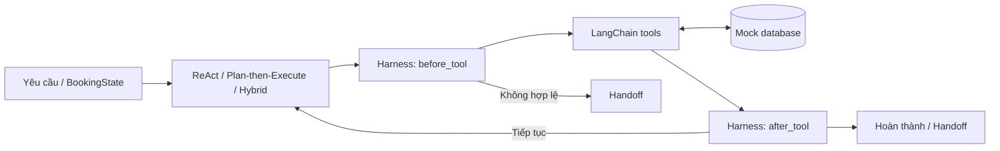

# ✈️ Airline Booking Agent

**Tìm chuyến bay → giữ chỗ → xác nhận vé, với Harness kiểm soát từng bước.**

Bài tập **SE373 – Kỹ thuật xây dựng hệ thống Agentic AI**, so sánh **ReAct**, **Plan-then-Execute** và **Hybrid** trên cùng dữ liệu mô phỏng.

Agent hiện quyết định bằng logic Python xác định. LangChain cung cấp giao diện tool; LangGraph triển khai workflow baseline. **Không cần API key, không gọi LLM hoặc dịch vụ đặt vé thật.**

## Điểm nổi bật

- 🛡️ Harness kiểm tra dữ liệu, quyền xác nhận, kết quả booking và bàn giao cho con người.
- 🔁 Phát hiện hành động lặp, observation lặp và trạng thái không tiến triển.
- ⚡ Mô phỏng chuyến bay hết chỗ hoặc bị hủy giữa tìm kiếm và giữ chỗ.
- 🧪 32 test; 10 tình huống × 3 agent = 30 lượt đánh giá có kiểm soát.

## 🚀 Chạy nhanh

Yêu cầu **Python 3.11+**, `pip`; cần Git nếu tải bằng clone. Chạy trong PowerShell:

```powershell
git clone https://github.com/ThankTran/airline-agent.git
cd airline-agent
python -m venv .venv
.\.venv\Scripts\python.exe -m pip install -r requirements.txt
.\.venv\Scripts\python.exe -m pip install -e .
.\.venv\Scripts\python.exe -m airline_agent.demo_graph
```

Nếu đã có mã nguồn, mở terminal tại `airline-agent` và bỏ qua hai lệnh đầu. Cài cả requirements và package vì `pyproject.toml` chưa khai báo dependency runtime. Không cần kích hoạt môi trường hoặc cấu hình `.env`.

**macOS/Linux:** tạo môi trường bằng `python3 -m venv .venv`, sau đó thay `.\.venv\Scripts\python.exe` bằng `.venv/bin/python` trong các lệnh.

## Chạy ba agent

```powershell
.\.venv\Scripts\python.exe -m airline_agent.react_agent
.\.venv\Scripts\python.exe -m airline_agent.plan_execute_agent
.\.venv\Scripts\python.exe -m airline_agent.hybrid_agent
```

Demo dùng **SGN → HAN**, ngày **2026-10-15**, hành khách `Nguyen Van A`, đã cho phép xác nhận. Khi database vừa reset, kết quả bình thường có `status="completed"`, `flight_id="VN002"`, `booking_id="BOOK-001"`.

Thử phục hồi khi chuyến vừa tìm được hết chỗ, trong Python của môi trường đã cài:

```python
from airline_agent.database import reset_database
from airline_agent.fault_injection import FaultInjector
from airline_agent.hybrid_agent import HybridAgent

reset_database()
request = {
    "origin": "SGN", "destination": "HAN", "date": "2026-10-15",
    "passenger_name": "Nguyen Van A", "user_intent": "book",
    "user_confirmed_booking": True,
}
agent = HybridAgent(
    fault_injector=FaultInjector(scenario="sold_out_after_search")
)
result = agent.run(request)
print(result["status"], result.get("flight_id"), result.get("retry_count"))
# completed VN007 1
```

Đổi fault thành `cancelled_after_search` để thử hủy chuyến. Đặt `user_confirmed_booking=False` để kiểm tra chặn xác nhận; đặt thêm `user_intent="search"` để chỉ tìm kiếm. Dùng mã sân bay viết hoa, ngày có trong [database.py](src/airline_agent/database.py), và reset database trước mỗi thí nghiệm độc lập.

## Kiến trúc



| Thành phần | Vai trò |
| --- | --- |
| ReAct | Chọn bước theo state và observation; tối đa 12 bước, 2 lượt retry phục hồi lỗi chuyến bay. |
| Plan-then-Execute | Kế hoạch cố định; bàn giao khi thất bại, không tự lập lại kế hoạch. |
| Hybrid | Kết hợp kế hoạch với state thực tế; tối đa 2 lần re-plan. |
| Harness | Kiểm tra tuyến/ngày, chuyến/hold, quyền commit; xác minh booking trong database và phát hiện loop/stall. |
| LangGraph baseline | Workflow `validate → search → hold → confirm → completion`, có nhánh dừng khi lỗi. |

Năm tool: `search_flights`, `get_flight_detail`, `hold_flight`, `confirm_booking`, `cancel_hold`. Luồng đặt vé chính dùng search, hold và confirm. Payload handoff gồm `stop_reason`, `attempted_actions`, `state_snapshot`, `question_for_human`.

## 🧪 Kiểm thử và đánh giá

Chạy tại thư mục gốc repo:

```powershell
.\.venv\Scripts\python.exe -m pytest -q
.\.venv\Scripts\python.exe -m airline_agent.evaluation
```

Bộ đánh giá gồm đặt vé bình thường, thiếu ngày, trùng sân bay, mã sân bay sai, không có chuyến, thiếu tên, chưa cho phép xác nhận, chỉ tìm kiếm và hai lỗi động. Database được reset trước mỗi lượt.

Kiểm tra ngày **06-10-2026**: **32 test pass, 30/30 lượt đúng hành vi kỳ vọng**.

| Agent | Đúng kỳ vọng | Phục hồi S09–S10 | Lần thử gọi tool TB | Booking trái phép |
| --- | ---: | ---: | ---: | ---: |
| ReAct | 10/10 | 2/2 | 2.3 | 0 |
| Plan-then-Execute | 10/10 | 0/2 | 1.4 | 0 |
| Hybrid | 10/10 | 2/2 | 2.2 | 0 |

**Cách đọc:** đúng kỳ vọng bao gồm cả bàn giao an toàn và hoàn thành tìm kiếm. Plan-then-Execute được kỳ vọng handoff ở S09–S10; 100% đúng kỳ vọng không có nghĩa 100% đặt vé thành công. `tool_calls` đếm `attempted_actions`, kể cả hành động bị Harness chặn; `observation_count` phản ánh số tool thực thi.

Evaluation tạo hoặc ghi đè [evaluation_results.csv](reports/evaluation_results.csv) (chi tiết 30 lượt) và [evaluation_summary.csv](reports/evaluation_summary.csv) (tổng hợp). [report.md](reports/report.md) chứa phân tích bổ sung, không được sinh lại bởi lệnh này.

## Cấu trúc mã nguồn

```text
airline-agent/
├── src/airline_agent/
│   ├── database.py           # FLIGHTS, HOLDS, BOOKINGS và reset
│   ├── tools.py              # 5 tool nghiệp vụ
│   ├── state.py              # BookingState
│   ├── harness.py            # BookingHarness, LoopDetector
│   ├── booking_graph.py      # Workflow baseline LangGraph
│   ├── demo_graph.py         # Demo baseline
│   ├── react_agent.py        # ReActAgent
│   ├── plan_execute_agent.py # PlanThenExecuteAgent
│   ├── hybrid_agent.py       # HybridAgent
│   ├── fault_injection.py   # Biến cố có kiểm soát
│   └── evaluation.py        # Kịch bản, thống kê và xuất CSV
├── tests/                   # Database, tools, harness, agents, faults
├── reports/                 # Kết quả và phân tích
├── requirements.txt
├── pyproject.toml
└── LICENSE
```

## Phạm vi và xử lý lỗi nhanh

Dữ liệu nằm trong RAM; chưa có lưu trữ bền vững, thanh toán, xác thực thật hoặc xử lý cạnh tranh giữ ghế. Kết quả chỉ phản ánh tập kịch bản mô phỏng; chưa đo reasoning của LLM, latency hay chi phí token. Dependency hiện chưa khóa phiên bản.

| Vấn đề | Cách xử lý |
| --- | --- |
| `No module named airline_agent` | Chạy `-m pip install -e .` từ gốc repo bằng đúng Python trong `.venv`. |
| Thiếu `langgraph`, `langchain_core`, `pytest` | Cài `-m pip install -r requirements.txt` bằng cùng Python. |
| Không tìm được chuyến | Kiểm tra tuyến/ngày trong dữ liệu mẫu; demo dùng SGN–HAN, 2026-10-15. |
| Kết quả khác sau nhiều lần chạy trong một phiên | Gọi `reset_database()`; thao tác giữ chỗ làm giảm số ghế. |

## Tác giả và giấy phép

**Trần Thị Hồng Thanh · 24521643** — Trường Đại học Công nghệ Thông tin, ĐHQG-HCM.

[Mã nguồn GitHub](https://github.com/ThankTran/airline-agent) · [Giấy phép MIT](LICENSE)
