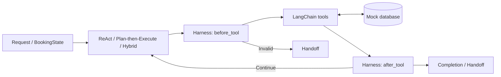

# ✈️ Airline Booking Agent

**Search flights → hold a seat → confirm a booking, with a Harness checking every step.**

An assignment for **SE373 – Agentic AI System Engineering**, comparing **ReAct**, **Plan-then-Execute**, and **Hybrid** using the same mock data.

Agents currently make decisions through deterministic Python logic. LangChain provides the tool interface; LangGraph implements the baseline workflow. **No API key is required, and no LLM or real booking service is called.**

## Highlights

- 🛡️ A Harness validates data, confirmation authorization, booking results, and handoffs to humans.
- 🔁 Detection of repeated actions, repeated observations, and stalled state.
- ⚡ Simulation of flights selling out or being cancelled between search and hold.
- 🧪 32 tests; 10 scenarios × 3 agents = 30 controlled evaluation runs.

## 🚀 Quick start

Requires **Python 3.11+** and `pip`; Git is needed to clone the repository. Run in PowerShell:

```powershell
git clone https://github.com/ThankTran/airline-agent.git
cd airline-agent
python -m venv .venv
.\.venv\Scripts\python.exe -m pip install -r requirements.txt
.\.venv\Scripts\python.exe -m pip install -e .
.\.venv\Scripts\python.exe -m airline_agent.demo_graph
```

If you already have the source code, open a terminal in `airline-agent` and skip the first two commands. Install both the requirements and the package because `pyproject.toml` does not yet declare runtime dependencies. Activating the environment or configuring `.env` is not required.

**macOS/Linux:** create the environment with `python3 -m venv .venv`, then replace `.\.venv\Scripts\python.exe` with `.venv/bin/python` in the commands.

## Run the three agents

```powershell
.\.venv\Scripts\python.exe -m airline_agent.react_agent
.\.venv\Scripts\python.exe -m airline_agent.plan_execute_agent
.\.venv\Scripts\python.exe -m airline_agent.hybrid_agent
```

The demos use **SGN → HAN** on **2026-10-15**, passenger `Nguyen Van A`, with booking confirmation authorized. After a database reset, a normal result includes `status="completed"`, `flight_id="VN002"`, and `booking_id="BOOK-001"`.

Try recovering when a flight sells out after search, using Python from the installed environment:

```python
from airline_agent.database import reset_database
from airline_agent.fault_injection import FaultInjector
from airline_agent.hybrid_agent import HybridAgent

reset_database()
request = {
    "origin": "SGN", "destination": "HAN", "date": "2026-10-15",
    "passenger_name": "Nguyen Van A", "user_intent": "book",
    "user_confirmed_booking": True,
}
agent = HybridAgent(
    fault_injector=FaultInjector(scenario="sold_out_after_search")
)
result = agent.run(request)
print(result["status"], result.get("flight_id"), result.get("retry_count"))
# completed VN007 1
```

Change the fault to `cancelled_after_search` to test cancellation. Set `user_confirmed_booking=False` to test blocked confirmation; also set `user_intent="search"` for search only. Use uppercase airport codes and dates available in [database.py](src/airline_agent/database.py), and reset the database before each independent experiment.

## Architecture



| Component | Role |
| --- | --- |
| ReAct | Selects steps based on state and observations; up to 12 steps and 2 recovery retries for flight failures. |
| Plan-then-Execute | Uses a fixed plan; hands off on failure without automatic replanning. |
| Hybrid | Combines a plan with the current state; up to 2 replans. |
| Harness | Validates route/date, flight/hold, and commit authorization; verifies bookings in the database and detects loops/stalls. |
| LangGraph baseline | Runs `validate → search → hold → confirm → completion`, with branches that stop on errors. |

The five tools are `search_flights`, `get_flight_detail`, `hold_flight`, `confirm_booking`, and `cancel_hold`. The main booking flow uses search, hold, and confirm. A handoff payload includes `stop_reason`, `attempted_actions`, `state_snapshot`, and `question_for_human`.

## 🧪 Testing and evaluation

Run from the repository root:

```powershell
.\.venv\Scripts\python.exe -m pytest -q
.\.venv\Scripts\python.exe -m airline_agent.evaluation
```

The evaluation covers normal booking, missing date, identical airports, invalid airport code, no matching flight, missing passenger name, unauthorized confirmation, search-only intent, and two dynamic faults. The database is reset before each run.

Verified on **October 6, 2026**: **32 tests passed, and 30/30 runs matched the expected behavior**.

| Agent | Matched expectations | Recovery in S09–S10 | Avg. attempted tool calls | Unauthorized bookings |
| --- | ---: | ---: | ---: | ---: |
| ReAct | 10/10 | 2/2 | 2.3 | 0 |
| Plan-then-Execute | 10/10 | 0/2 | 1.4 | 0 |
| Hybrid | 10/10 | 2/2 | 2.2 | 0 |

**How to read the results:** expected behavior includes safe handoffs and completed searches. Plan-then-Execute is expected to hand off in S09–S10; matching expectations in 100% of runs does not mean every run creates a booking. `tool_calls` counts `attempted_actions`, including actions blocked by the Harness; `observation_count` reflects executed tools.

Evaluation creates or overwrites [evaluation_results.csv](reports/evaluation_results.csv) (details of 30 runs) and [evaluation_summary.csv](reports/evaluation_summary.csv) (aggregate results). [report.md](reports/report.md) contains additional analysis and is not regenerated by this command.

## Project structure

```text
airline-agent/
├── src/airline_agent/
│   ├── database.py           # FLIGHTS, HOLDS, BOOKINGS, and reset
│   ├── tools.py              # 5 business tools
│   ├── state.py              # BookingState
│   ├── harness.py            # BookingHarness, LoopDetector
│   ├── booking_graph.py      # Baseline LangGraph workflow
│   ├── demo_graph.py         # Baseline demo
│   ├── react_agent.py        # ReActAgent
│   ├── plan_execute_agent.py # PlanThenExecuteAgent
│   ├── hybrid_agent.py       # HybridAgent
│   ├── fault_injection.py   # Controlled faults
│   └── evaluation.py        # Scenarios, statistics, and CSV export
├── tests/                   # Database, tools, harness, agents, faults
├── reports/                 # Results and analysis
├── requirements.txt
├── pyproject.toml
└── LICENSE
```

## Scope and troubleshooting

Data is stored in memory; persistent storage, payments, real authentication, and concurrent seat reservation handling are not implemented. Results reflect only the simulated scenarios; LLM reasoning, latency, and token costs have not been measured. Dependency versions are not currently pinned.

| Problem | Solution |
| --- | --- |
| `No module named airline_agent` | Run `-m pip install -e .` from the repository root using the correct Python in `.venv`. |
| Missing `langgraph`, `langchain_core`, or `pytest` | Install with `-m pip install -r requirements.txt` using the same Python. |
| No matching flight | Check the route/date in the sample data; the demos use SGN–HAN, 2026-10-15. |
| Different results after repeated runs in one session | Call `reset_database()`; holding a seat reduces the available seat count. |

## Author and license

**Trần Thị Hồng Thanh · 24521643** — University of Information Technology, VNU-HCM.

[GitHub source code](https://github.com/ThankTran/airline-agent) · [MIT License](LICENSE)
